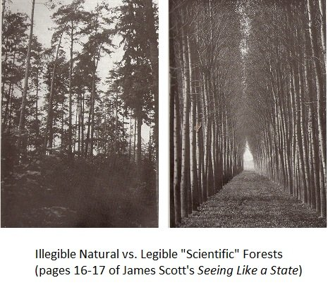

# Read

I read less from books and more online last week, probably because I wanted more to include here. This was a mistake, as it turns out writing is hard and takes a while.

### <a href="https://alexdanco.com/2019/04/28/secrets-about-people-a-short-and-dangerous-introduction-to-rene-girard/" target="_blank">Secrets about People</a>

This is Alex Danco’s introduction to the ideas of René Girard. Girard was a French historian and philosopher whose contrarian theories and tenure at Stanford helped garner a cult following around Silicon Valley. This was hard to read at times given the implications of a Girardian worldview, but fascinating throughout.

Danco outlines Girard’s most popular ideas including mimetic desire (“we don’t want; we want to *be*”), internal and external mediators of desire (which differ in their *distance* and *differentiation*), mimetic violence (“the most dangerous threat” to premodern communities), scapegoating (a gruesome reprieve), and the role of early religious hierarchies (to increase differentiation thus decreasing violence).

He then describes how Girard’s ideas can help explain parts of society today, including the effects of social media on our happiness:
> ... the internet makes it easier to gaze longingly at the people we admire and envy, and creates an overpowering amount of pressure for you to become, and be seen as, a particular type of person ... People say, “Everyone is miserable because all we do is want things.” Okay, well what is causing us to want things? It has little to do with the fact that we’re being shown shown these things online 24/7, and everything to do with the fact that we’re seeing *our peers* online 24/7.

### <a href="https://astralcodexten.substack.com/p/ontology-of-psychiatric-conditions" target="_blank">Ontology Of Psychiatric Conditions: Taxometrics</a>

This post by Scott Alexander, the first in a series about psychiatry, gives a high-level overview of taxometrics. I had never heard of taxometrics, but had wondered about its focus: “whether psychiatric conditions are categorical or dimensional.” Eg are people with ADHD an easily distinguishable subgroup (categorical) or the tail end of an attention distribution that we’re all a part of (dimensional)?

The answer seems to be that most conditions are dimensional. This does not mean that they’re somehow not real. As Alexander states, “Just because something is on a continuum with something else, doesn’t mean it has to be close to it.” ADHD and general absent-mindedness are parts of the same distribution, but are different enough to warrant distinct vocabulary and thought.

This conclusion has important implications for understanding treatments.
>... a lot of people still want psychiatry to deliver the single specific thing. It’s not going to be able to do that. If you hold out hope, you’ll either end up overmedicalizing everything, or you’ll get disillusioned and radicalized and start saying all psychiatry is fake. I think either would be a mistake.

Psychiatric treatment is more trial-and-error than magic bullet, and that’s okay.

### <a href="https://www.ribbonfarm.com/2010/07/26/a-big-little-idea-called-legibility/" target="_blank">A Big Little Idea Called Legibility</a>

### <a href="https://slatestarcodex.com/2017/03/16/book-review-seeing-like-a-state/" target="_blank">Book Review: Seeing Like A State</a>

Both of the above cover James C. Scott’s *Seeing Like a State*.

A central idea of Scott’s book is the incentive of modern nation states to increase the *legibility* of their domain. He means legibility in the literal, visual sense of being easy to see. A good example is Prussian “scientific” forestry.

Why chop down trees where they are like a dummy? Instead, mow down the forest and replace it with only the highest-yield Norway Spruce, arranged in a Scientifically Approved grid. This turned out to be a bad idea.
>The endless rows of identical trees were a perfect breeding ground for plant diseases and forest fires. And the complex ecological processes that sustained the soil stopped working, so after a generation the Norway spruces grew stunted and malnourished. Yet for some reason, everyone involved got promoted, and “scientific forestry” spread across Europe and the world.

Governments want this because legible things are easier quantify and tax. 

This phenomenon of prioritizing legibility was popular in part thanks to proponents of <a href="https://en.wikipedia.org/wiki/High_modernism" target="_blank">High Modernism</a>, “an aesthetic taste masquerading as a scientific philosophy.”
>The High Modernists claimed to be about figuring out the most efficient and high-tech way of doing things, but most of them knew little relevant math or science and were basically just LARPing being rational by placing things in evenly-spaced rectangular grids.

The High Modernists majorly influenced today’s world, for better and for worse. The common thread across all of their failures is hubris. Complex systems like forests and cities can't be abstracted into orderly replicas without missing important features that make the organic versions work well.

# Seen

### <a href="https://www.hbo.com/how-to-with-john-wilson" target="_blank">How To with John Wilson</a>

https://youtu.be/w7aSybHRa6s

So, so good, though I suspect that this won’t appeal to everybody. It has many of the same qualities as *Nathan For You* (both were produced by Nathan Fielder), but without the mean spirit. I never felt like I was watching a prank show. *How To with John Wilson* is always awkward and mostly hysterical, but also disgusting, distressing, and shockingly sincere. Highly recommended.

### <a href="https://www.imdb.com/title/tt4698684/" target="_blank">Hunt for the Wilderpeople</a>

My second viewing. Funny and heart-warming, this is a great way to spend a weekend afternoon.

# Heard

### <a href="https://www.youtube.com/watch?v=krB0enBeSiE" target="_blank">Brendan Eich on the Lex Fridman Podcast</a>

Lex Fridman has consistently had great guests from the beginning. On this episode, he talks with Brendan Eich (JavaScript, Mozilla, Brave Browser) for nearly three hours. They discuss the creation of JavaScript, the <a href="https://en.wikipedia.org/wiki/Browser_wars" target="_blank">browser wars</a>, why nerds of a certain age might distrust Bill Gates, and how Brave wants to change the web.

### <a href="https://open.spotify.com/playlist/37i9dQZF1DZ06evO22trna" target="_blank">Some Sturgill</a>

I’ve been loving his new stuff. It’s hard to go wrong here.

https://open.spotify.com/playlist/37i9dQZF1DZ06evO22trna